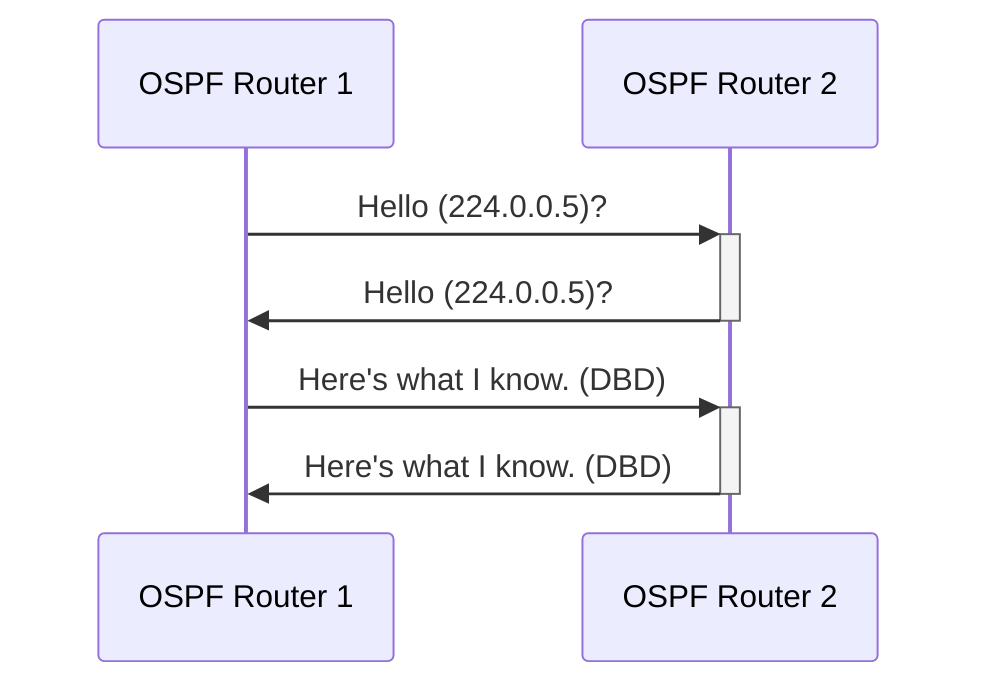
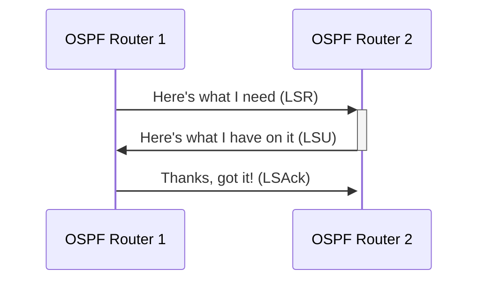

**Compared to RIPv2:**

| Characteristic                | **OSPF**                | RIPv2                  |
| ----------------------------- | ----------------------- | ---------------------- |
| Classless support             | **Yes**                 | Yes                    |
| VLSM/CIDR support             | **Yes**                 | Yes                    |
| Auto-summarization            | **No**                  | Yes                    |
| Manual summarization          | **Yes**                 | Yes                    |
| Route propagation             | **Multicast on change** | Multicast periodically |
| Path metric                   | **Bandwidth**           | Hops                   |
| Hop count limit               | **None**                | 15                     |
| Convergence                   | **Fast**                | Slow                   |
| Hierarchal network requirment | **Yes (Areas)**         | No (Flat only)         |
| Updates                       | **Event triggered**     | Periodic               |
| Route computation             | **Dijkstra**            | Bellman-Ford           |

A hierarchal design allows larger internetworks to be segmented into smaller internetworks. 

**This brings the following advantages:**
- Decreased routing overhead
- Decreased convergence time
- Isolates network instability

**Area 0** is the backbone of OSPF and every OSPF network must have an area 0. The routers that connect other networks to area 0 inside an autonomous system are referred to as:
**Area Border Routers.**
- *Autonomous system* refers to a collection of networks that share common administration and routing strategy.

Multiple autonomous systems can be connected together. The router that connects these ASs together is called an **Autonomous System Boundary Router (ASBR).**

## OSPF Terminology

**Link:** A network or router interface assigned to any given network. When an interface is added to the OSPF process it's considered to be a link. 

**Router ID:** The name of a router in the OSPF process. This is usually derived from the highest loopback IP on the router, but if that's not available, the highest interface IP address is used. 

**Neighbor:** Two or more routers that have an interface on a common network, such as two routers connected on a P2P serial link. In order for two routers to become neighbors they need to have the same settings for the following: 
1. Area ID
2. Stub Area Flag
3. Authentication password
4. Hello and Dead intervals

**Adjacency:** A relationship between two OSPF routers that permits the exchange of updates. OSPF is picky about sharing updates -- only shares information with neighbors with established adjacency. In multi-access connections, routers form adjacencies with the DR and BDR. 

**Designated Router (DR):** In a multi-access network, the DR is elected to reduce formed adjacencies and to publicized received routing information to and from connected routers within the same broadcast domain or link. Election are won based on priority level (default is 1). If there is a tie, the router with the highest router ID wins.

**Backup Designated Router (BDR):** The BDR acts as a hot standby for the DR. It receives everything the DR receives but does not send LSAs unless the DR is down. 

**Hello protocol:** Packets that enable dynamic neighbor discovery and maintain neighbor relationships. Addressed to multicast address **224.0.0.5**.

**Neighborship database:** A database containing information about all OSPF routers for which Hello packets have been seen. Router ID, and state are maintained in this database. 

**Topological database:** A database that contains information about all Link State Advertisements received and places the information into Dijkstra's algorithm to compute the shortest path to every network.

**Link State Advertisement:** A OSPF data packet containing link-state and routing information that shared among OSPF routers. 

**OSPF Area:** A OSPF area is a grouping of contiguous networks and routers. Routers within an area share an Area ID on the interface configured for that area. A router can be apart of multiple areas so each interface will have the Area ID of the area it's configured to connect to.

**Broadcast (multi-access):** A broadcast/multi-access network allows multiple devices to connect to or access the same network, enabling a broadcast ability so a single packet can be delivered to multiple endpoints. 

**Nonbroadcast multi-access (NBMA):** A nonbroadcast multi-access networks like Frame Relay, X.25, and Asynchronous Transfer Mode (ATM) allows for multi-access without the broadcast ability. Requires special configuration to work with OSPF. 

**Point-to-point:** A type of network topology made up of a direct connection between two routers that provide a single communication path. Can either be physical or logical

**Point-to-multipoint:** A type of network topology made of a single interface on a router connected to multiple destination routers. This can be further classified according to whether or not it supports broadcast traffic. This is important as it determines the kind of OSPF configuration that can be deployed.

## OSPF Operation

This can be divided into **three categories:**
1. Neighbor and adjacency initialization
2. LSA flooding
3. SPF calculation

#### Neighbor and Adjacency Initialization
The Hello protocol is used to discover neighbors and establish adjacencies, and maintain relationships with other OSPF routers. In environments that support multicast traffic, Hello packets are sent out periodically. The address for this multicast traffic is **224.0.0.5**. Broadcast and P2P networks sent Hellos every 10s, for P2MP and non-broadcast networks Hellos are sent every 30s.

#### LSA Flooding
After the neighborships and adjacencies are formed, the OSPF routers send Link State Update (LSU) packets containing LSAs. An LSU packet contains a number of LSAs which provide link-state information about all the OSPF routers within the area. Network topology is created using the information within LSU packets. After the initial flooding, LSAs are only sent out when changes occur in the network.

| Network Type               | Multicast Address                  | Description    |
| -------------------------- | ---------------------------------- | -------------- |
| **Point-to-point (P2P)**       | 224.0.0.5                          | AllOSPFRouters |
| **Broadcast**                  | 224.0.0.6                          | AllDRRouters   |
| **Point-to-multipoint (P2MP)** | Uses *adjacent routers* unicast IP | N/A            |

After the LSUs are sent, the routers must send a Link State Acknowledgement (LSAck) to signify they got the updates.

Database Description (DbD) packet contains information about what information the OSPF router knows. 

#### SPF Tree Calculation
An OSPF router calculates the best route using the Shortest Path First algorithm which arranges the routers in a tree like structure with the routers are the roots and the different networks are along branches and leaves.
##### OSPF Metrics
The metric OSPF uses is referred to as *cost*. The cost of an entire path is the sum of the cost of the outgoing interfaces along the path. For Cisco, cost is defined as $10^{8}$/bandwidth.

